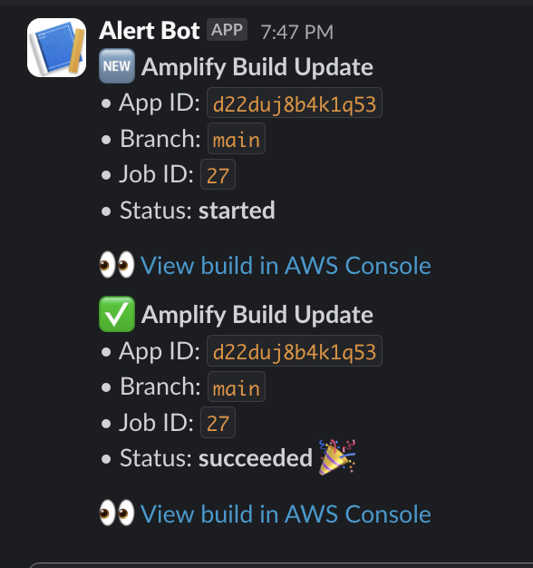

# Amplify Hosting Slackbot
This tutorial will setup a Slack bot to get alerts when new Amplify Hosting builds kickoff and finish. 

This uses an integration with [Amazon Eventbridge](https://aws.amazon.com/pm/eventbridge). We will setup an Eventbridge rule to watch for Amplify events which will trigger a Lambda function that then pings the Slack webhook. 

Amplify Hosting -> Eventbridge rule -> Lambda function -> Slack webhook



## Setup a Slack app

1. Create the Slack app -> https://api.slack.com/apps
2. Within this app, click Incoming Webhooks and enable it. Add it to a channel and keep the webhook URL handy

## Configure your Lambda function 

Eventbridge will post an object with this schema to Lambda 
```
{
    "version": "0",
    "id": "cd217209-2c91-729c-30b7-xxxxxx",
    "detail-type": "Amplify Deployment Status Change",
    "source": "aws.amplify",
    "account": "xxxxxxxxxxxx",
    "time": "2025-02-24T21:37:21Z",
    "region": "us-east-1",
    "resources": [
        "arn:aws:amplify:us-east-1:xxxxxxx:apps/amplify_app_id/branches/main/jobs/xxxx__job_id"
    ],
    "detail": {
        "appId": "xxxxxxxx",
        "branchName": "main",
        "jobId": "20",
        "jobStatus": "CANCELLED"
    }
}
```

1. Setup a lambda function to notify whatever service you'd like when an event occurs (ie, Slack, Discord server, Twitter/X, an API). In this tutorial, we will focus on notifying a Slack channel.
2. Go to the Lambda service, create a new function. 
3. I used the [code here](index.mjs)
4. Save, deploy and test this function.

## Configure Eventbridge

1. Head to the [Eventbridge console](https://us-east-1.console.aws.amazon.com/events/home)
2. Click on the Rules tab (under Buses) and create rule 
3. Select the default bus and for Rule type: Rule with an event pattern
4. For event source: AWS events or EventBridge partner events
5. Then under event pattern select the AWS Amplify service and All events
6. Then edit the pattern and use something roughly like the below

```
{
  "source": ["aws.amplify"],
  "detail-type": ["Amplify Deployment Status Change"],
  "detail": {
    "appId": ["d22duj8b4kxxxx"],
    "jobStatus": ["SUCCEED", "FAILED", "STARTED", "PENDING", "CANCELLED"]
  }
}
```

The pattern only actions on events that meet the pattern criteria, so if you are less specific you will action on more events. For example, if you don't include an appId it will trigger on all Amplify Apps or if you only want to alert on build failed only include `FAILED` in the status list. In my example, I'm alerting on those job status for that single app. 

7. For Target, select AWS service, then Lambda function, in this account and select the function you created in the previous step. Make sure you have a valid role selected.
8. Review and save the rule

You should now be good to go! Test it by kicking off a deploy and you should see the alert in Slack 


### Debugging 

You can use the Lambda logs to ensure that Eventbridge is firing off the Lambda function and analyzing logs 


